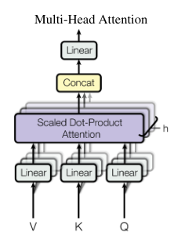
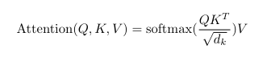

<p align="center">
  
</p>

<h1 align="center">minnak-gpt</h1>

<p align="center">
  <strong>Transformer Implementation from Scratch</strong>
</p>

<p align="center">
  <a href="https://www.youtube.com/@hsperus">
    
  </a>
  <a href="https://huggingface.co/omertarikyilmaz">
    
  </a>
  
  
  <a href="LICENSE">
    
  </a>
</p>

<p align="center">
  <em>Tutorial series available in English & Turkish</em>
</p>

---

## Overview

**minnak-gpt** is a pure NumPy implementation of the Transformer architecture from the legendary paper ["Attention Is All You Need"](https://arxiv.org/abs/1706.03762) (Vaswani et al., 2017).

This project is designed for **educational purposes**, providing a clear, readable implementation of every component without relying on any deep learning frameworks like PyTorch or TensorFlow.

### Key Features

| Feature | Description |
|---------|-------------|
| **Autograd Engine** | Custom automatic differentiation system that tracks operations and computes gradients through backpropagation. Supports all essential operations: matmul, add, mul, exp, reshape, transpose. |
| **Multi-Head Attention** | Parallel attention mechanism that allows the model to jointly attend to information from different representation subspaces at different positions. |
| **Encoder-Decoder** | Full sequence-to-sequence architecture with N stacked encoder and decoder layers, residual connections, and layer normalization. |
| **Optimizers** | Adam optimizer with adaptive learning rates and first/second moment estimates. SGD with momentum for comparison. |
| **Cross-Entropy Loss** | Negative log-likelihood loss with numerically stable softmax computation and proper gradient flow. |
| **Positional Encoding** | Sinusoidal position embeddings that inject sequence order information without learned parameters. |
| **Layer Normalization** | Normalizes activations across the feature dimension with learnable scale (γ) and shift (β) parameters. |

---

## Architecture

<p align="center">
  
</p>

The Transformer architecture revolutionized NLP by replacing recurrence with self-attention:

```
Input → Embedding → Positional Encoding → [Encoder × N] → [Decoder × N] → Linear → Output
                         ↓                      ↓
                   Multi-Head              Multi-Head
                   Attention               Attention
                        +                      +
                   Feed Forward            Cross-Attention
                        +                      +
                   Layer Norm              Feed Forward
```

### Attention Mechanism

<p align="center">
  
</p>

The scaled dot-product attention computes:

$$\text{Attention}(Q, K, V) = \text{softmax}\left(\frac{QK^T}{\sqrt{d_k}}\right)V$$

---

## Project Structure

```
minnak-gpt/
├── minnak_gpt/                 # Main package
│   ├── engine/                 # Autograd engine
│   │   └── tensor.py           # Tensor with automatic differentiation
│   ├── nn/                     # Neural network modules
│   │   ├── layers.py           # Embedding, Linear, LayerNorm, Dropout, etc.
│   │   ├── blocks.py           # MultiHeadAttention, FeedForward, Encoder/Decoder
│   │   └── functional.py       # Activation functions (ReLU, Softmax)
│   ├── optim/                  # Optimization algorithms
│   │   └── optimizer.py        # SGD (momentum) & Adam
│   ├── data/                   # Data handling utilities
│   │   └── dataloader.py       # Batch creation and iteration
│   ├── losses.py               # Loss functions (CrossEntropy)
│   └── model.py                # Complete Transformer model
├── assets/                     # Diagrams and images
├── scripts/                    # Training and inference scripts
├── tests/                      # Unit tests
├── LICENSE                     # MIT License
└── requirements.txt            # Dependencies (just NumPy!)
```

---

## Quick Start

### Installation

```bash
# Clone the repository
git clone https://github.com/omertarikyilmaz/minnak-gpt.git
cd minnak-gpt

# Install dependencies
pip install -r requirements.txt
```

### Basic Usage

```python
from minnak_gpt import Transformer
from minnak_gpt.engine import Tensor
from minnak_gpt.optim import Adam
from minnak_gpt.losses import CrossEntropyLoss

# Initialize model
model = Transformer(
    vocab_size=10000,    # Vocabulary size
    embed_dim=512,       # Embedding dimension
    num_heads=8,         # Number of attention heads
    ff_dim=2048,         # Feed-forward dimension
    num_layers=6,        # Number of encoder/decoder layers
    seq_len=128,         # Maximum sequence length
    dropout=0.1
)

# Forward pass
src = [[1, 2, 3, 4, 5]]   # Source tokens
tgt = [[6, 7, 8, 9, 10]]  # Target tokens
logits = model(src, tgt)

# Training setup
optimizer = Adam(model.parameters(), lr=1e-4)
criterion = CrossEntropyLoss()

# Training step
optimizer.zero_grad()
loss = criterion(logits, target_labels)
loss.backward()
optimizer.step()
```

---

## Key Components

| Component | Description |
|-----------|-------------|
| `Tensor` | Core data structure with automatic gradient computation |
| `MultiHeadAttention` | Parallel attention computation over multiple heads |
| `FeedForward` | Two-layer MLP applied position-wise |
| `EncoderBlock` | Self-attention + FFN with residual connections |
| `DecoderBlock` | Self-attention + cross-attention + FFN |
| `Adam` / `SGD` | Optimization algorithms with momentum support |
| `CrossEntropyLoss` | Loss function for language modeling |
| `DataLoader` | Batch creation and iteration utilities |

---

## From the Paper

> *"We propose a new simple network architecture, the Transformer, based solely on attention mechanisms, dispensing with recurrence and convolutions entirely."*
>
> — Vaswani et al., "Attention Is All You Need" (2017)

### Key Concepts Implemented

| Concept | Implementation |
|---------|----------------|
| Scaled Dot-Product Attention | `MultiHeadAttention.forward()` |
| Positional Encoding | `PositionalEncodingLayer` (sinusoidal) |
| Multi-Head Attention | Q, K, V projections with head splitting |
| Layer Normalization | `LayerNormLayer` with learnable γ, β |
| Residual Connections | `x + sublayer(x)` pattern |

---

## Tutorial Series

<p align="center">
  <a href="https://www.youtube.com/@hsperus">
    
  </a>
</p>

Follow along with the video series explaining each component in detail:

| Topic | Status |
|-------|--------|
| Autograd Engine | Coming Soon |
| Tensor Operations | Coming Soon |
| Attention Mechanism | Coming Soon |
| Transformer Architecture | Coming Soon |
| Training Loop | Coming Soon |

---

## References

- [Attention Is All You Need](https://arxiv.org/abs/1706.03762) - Original paper
- [Hugging Face](https://huggingface.co/omertarikyilmaz) - Pre-trained models
- [YouTube Channel](https://www.youtube.com/@hsperus) - Video tutorials

---

## Contributing

Contributions are welcome. Feel free to:
- Report bugs
- Suggest features
- Submit pull requests

---

## License

This project is licensed under the MIT License. See the [LICENSE](LICENSE) file for details.

---

<p align="center">
  <strong>Built for learning</strong>
</p>

<p align="center">
  <a href="https://www.youtube.com/@hsperus">YouTube</a> •
  <a href="https://huggingface.co/omertarikyilmaz">Hugging Face</a>
</p>
